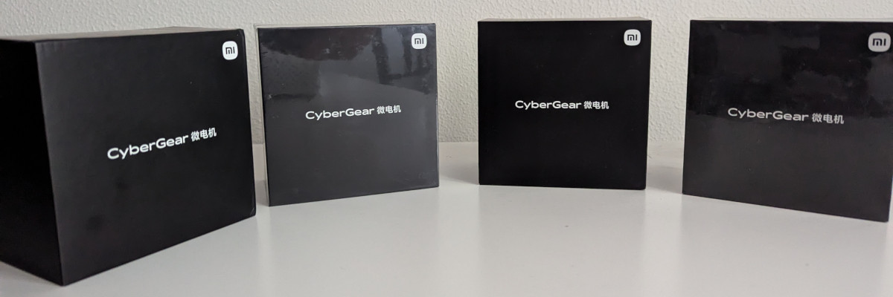
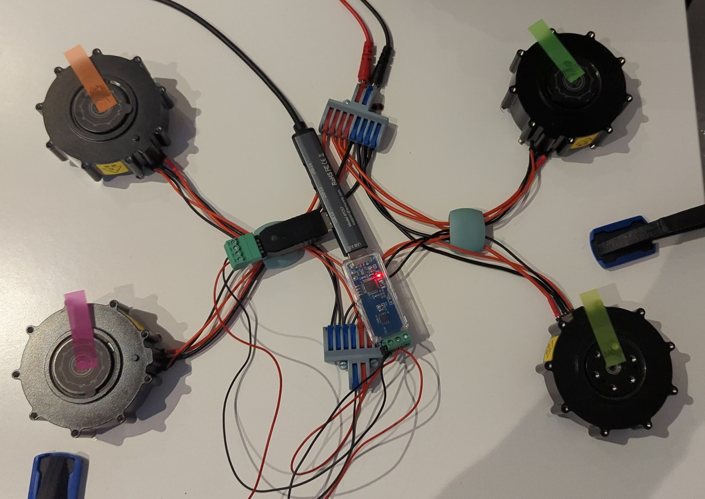
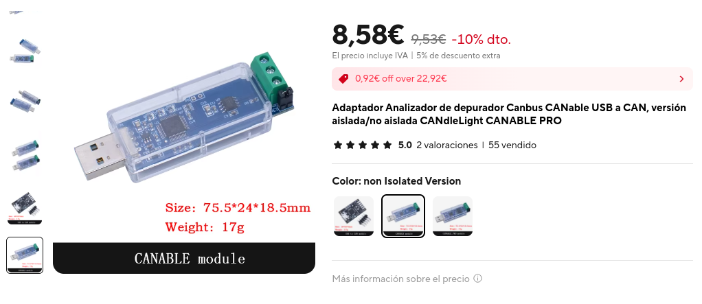
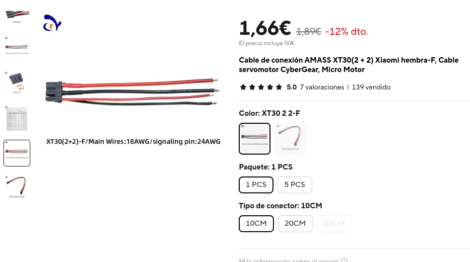

# cybergear

[](https://pypi.org/project/cybergear/)
[](https://pypi.org/project/cybergear/)
[](https://github.com/grrodre/cybergear/actions/workflows/ci.yml)
[](LICENSE)


*My four Xiaomi CyberGear motors (photo © [grrodre](https://github.com/grrodre))*

Python driver for the **[Xiaomi CyberGear](https://www.mi.com/cyber-gear)** brushless motor over CAN bus.

Built on top of [python-can](https://python-can.readthedocs.io/). Tested with SocketCAN; custom polling threads are used instead of BCM to support other python-can interfaces as well. 

If you run into any issues, feel free to open an issue.

---

## Features

- **Four control modes**: operation (MIT-style), position, speed, and current
- **Auto-scan**: discovers motors on the bus without needing to specify a CAN ID
- **Async feedback**: `can.Notifier`-based listener delivers `MotorFeedback` snapshots without blocking
- **Background polling**: portable parameter polling thread keeps properties up to date on any interface
- **Event callbacks**: subscribe to feedback, parameter updates, and fault state changes
- **Context-manager API**: guarantees clean resource release
- **Fault detection**: decodes and monitors over-temperature, over-current, undervoltage, and encoder faults

---

## Requirements

- Python 3.10+
- [python-can](https://python-can.readthedocs.io/) ≥ 4.4.2
- A CAN interface supported by python-can (e.g. SocketCAN `can0` at 1 Mbit/s)

---

## Installation

```bash
pip install cybergear
```

Or with [uv](https://docs.astral.sh/uv/):

```bash
uv add cybergear
```

To include the dashboard (requires [Textual](https://textual.textualize.io/) and Rich):

```bash
pip install cybergear[dashboard]
# or
uv add cybergear[dashboard]
```

---

## CLI tools

### Scan

Discover motors on the bus without writing any code:

```bash
cybergear-scan
cybergear-scan --interface socketcan --channel can0 --bitrate 1000000
```

Output:

```
Scanning CAN bus (timeout=0.5s)...

Found 1 motor(s):

  CAN ID     MCU Identifier
  ---------- --------------------
  1          8c1a313130333104
```

### Dashboard

Live TUI dashboard showing feedback, parameters, and quick motor controls (requires `cybergear[dashboard]`):

```bash
cybergear-dashboard
cybergear-dashboard --interface socketcan --channel can0 --bitrate 1000000 --can-id 1
```


---

## Quick start

```python
from cybergear import CyberGearMotor

bus_cfg = {'interface': 'socketcan', 'channel': 'can0', 'bitrate': 1_000_000}

with CyberGearMotor(bus_config=bus_cfg) as motor:
    motor.run_mode = 'speed'
    motor.enable()
    motor.spd_ref = 5.0          # 5 rad/s
```

Pass `can_id` explicitly if you have multiple motors on the bus:

```python
with CyberGearMotor(bus_config=bus_cfg, can_id=1) as motor:
    ...
```

You can also omit `bus_config` entirely and let python-can read from its [configuration file](https://python-can.readthedocs.io/en/stable/configuration.html) (`~/.can`, `can.ini`, or environment variables):

```python
# interface, channel, and bitrate are read from the python-can config file
with CyberGearMotor() as motor:
    ...
```

---

## Control modes

### Operation mode (MIT-style)

Directly command torque, position, velocity, and PD gains in a single frame:

```python
motor.motor_control(torque=0.0, position=1.57, velocity=0.0, kp=10.0, kd=0.5)
```

### Position mode

```python
motor.run_mode = 'position'
motor.enable()
motor.loc_ref = 3.14   # rad
```

### Speed mode

```python
motor.run_mode = 'speed'
motor.enable()
motor.spd_ref = 10.0   # rad/s
```

### Current mode

```python
motor.run_mode = 'current'
motor.enable()
motor.iq_ref = 1.0     # A
```

### Quick-move

```python
motor.quick_move(speed=5.0)   # rad/s
# ...
motor.quick_stop()
```

---

## Reading motor state

Feedback is updated asynchronously from incoming CAN frames. Read the latest snapshot via `motor.feedback`:

```python
fb = motor.feedback
print(fb.position, fb.velocity, fb.torque, fb.temperature)
print(fb.faults.has_fault)
```

Individual parameters polled in the background are also available as properties:

```python
print(motor.mech_pos)    # rad
print(motor.mech_vel)    # rad/s
print(motor.v_bus)       # V
```

---

## Event listeners

### Feedback listener

Called on every feedback frame in the `can.Notifier` thread. Keep callbacks fast.

```python
def on_feedback(fb):
    print(f'pos={fb.position:.3f} vel={fb.velocity:.3f}')

motor.add_feedback_listener(on_feedback)
motor.remove_feedback_listener(on_feedback)
```

### Parameter listener

Called whenever a polled parameter read response arrives.

```python
def on_param(name, value):
    print(f'{name} = {value}')

motor.add_parameter_listener(on_param)
```

### Fault listener

Called on any fault state transition (fault appears or clears).

```python
def on_fault(faults):
    if faults.has_fault:
        print('FAULT:', faults)

motor.add_fault_listener(on_fault)
```

---

## Bus scanning

Discover all motors on the bus without constructing a `CyberGearMotor`:

```python
motors = CyberGearMotor.scan(bus_config=bus_cfg)
for can_id, device_id in motors:
    print(f'found motor can_id={can_id}  device_id={device_id.hex()}')
```

---

## Motor limits

| Parameter | Min | Max |
|-----------|-----|-----|
| Position  | −12.5 rad | +12.5 rad |
| Velocity  | −30 rad/s | +30 rad/s |
| Torque    | −12 Nm | +12 Nm |
| Kp        | 0 | 500 |
| Kd        | 0 | 5 |

---

## API reference

### `CyberGearMotor`

| Method / Property | Description |
|---|---|
| `enable()` | Arm the motor (clears latched faults) |
| `disable()` | Disarm the motor gracefully |
| `emergency_brake()` | Cut torque immediately |
| `motor_control(torque, position, velocity, kp, kd)` | MIT-style operation mode frame |
| `quick_move(speed)` / `quick_stop()` | Simple velocity motion |
| `set_zero_position()` | Set current position as zero |
| `calibrate(callback)` | Trigger encoder calibration |
| `run_mode` | Get/set run mode (`'operation'`, `'position'`, `'speed'`, `'current'`) |
| `feedback` | Latest `MotorFeedback` snapshot |
| `scan(bus_config, ...)` | Class method: scan bus for motors |
| `start_polling(interval)` / `stop_polling()` | Control background parameter polling |
| `close()` | Release CAN bus and all resources |

### `MotorFeedback`

| Field | Unit | Range |
|---|---|---|
| `position` | rad | ±12.5 |
| `velocity` | rad/s | ±30 |
| `torque` | Nm | ±12 |
| `temperature` | °C | * |
| `mode` | int | 0 Reset, 1 Cal, 2 Run |
| `faults` | `FaultState` | * |

### `FaultState`

| Field | Description |
|---|---|
| `has_fault` | `True` if any fault is active |
| `over_temperature` | Motor over-temperature |
| `over_current` | Over-current protection |
| `undervoltage` | Supply undervoltage |
| `hall_encoding_failure` | Hall sensor fault |
| `magnetic_encoding_failure` | Magnetic encoder fault |
| `calibrated` | `False` if encoder not calibrated |

---

## Development

```bash
git clone https://github.com/grrodre/cybergear.git
cd cybergear_python
uv sync --dev
```

Run tests (excluding hardware tests):

```bash
uv run pytest -m "not hardware"
```

Hardware tests require a physical motor connected via CAN:

```bash
uv run pytest -m hardware
```

Lint and format:

```bash
uv run ruff check src/ tests/
uv run ruff format src/ tests/
uv run ty check
```

---

## Hardware


*Four Xiaomi CyberGear motors connected to the CANable USB adapter over a shared CAN bus.*

### CAN USB adapter



[CANable PRO — USB to CAN adapter](https://placeholder-link-canable)

Used to connect the CAN bus to a PC via USB. Bring up the interface at 1 Mbit/s:

```bash
sudo ip link set can0 type can bitrate 1000000
sudo ip link set can0 up
```

### Motor cable



[AMASS XT30(2+2) Xiaomi female cable for CyberGear](https://placeholder-link-xt30)

Power + signal cable required to connect the CyberGear motor (XT30 connector, 18 AWG power wires, 24 AWG signal wires).

---

## Author

**Gregorio Rodrigo** - [grrodre@gmail.com](mailto:grrodre@gmail.com)

---

## License

MIT, see [LICENSE](LICENSE).
