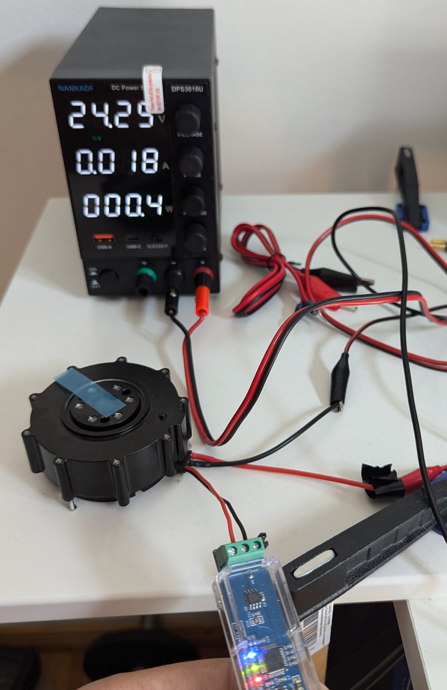
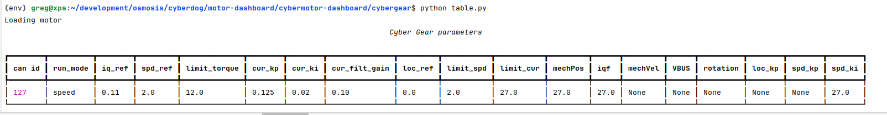

# cybergear

[](https://www.python.org/downloads/)

Python driver for the [Xiaomi CyberGear](https://www.mi.com/cyber-gear) brushless motor over CAN bus.



## Hardware

Tested with a [CANable USB adapter](https://es.aliexpress.com/item/1005006032351087.html) and an XT30(2+2) cable.


---

## Installation

```bash
pip install python-can
pip install .
```

Or with [uv](https://github.com/astral-sh/uv):

```bash
uv sync
```

### CAN interface setup (Linux)

Bring up the CAN interface at 1 Mbit/s before using the library:

```bash
sudo ip link set can0 type can bitrate 1000000
sudo ip link set can0 up
```

To make it persistent across reboots, add a systemd-networkd config or an `/etc/network/interfaces` entry for `can0`.

### python-can configuration

The driver reads CAN interface settings from `~/.can` automatically. Copy the example and edit it:

```bash
cp .can.example ~/.can
```

```ini
[default]
interface = socketcan
channel = can0
bitrate = 1000000
```

You can still pass `bus_config=` explicitly if you prefer (e.g. for multiple buses or test setups).

---

## Quick start

```python
from cybergear import CyberGearMotor

# CAN interface is read from ~/.can
with CyberGearMotor(can_id=0x01) as motor:
    motor.enable()

    fb = motor.feedback
    print(f'temp={fb.temperature:.1f} °C  pos={fb.position:.4f} rad')

    motor.disable()
```

`can_id` must match the motor's configured CAN node ID (default from factory: `0x7F`).

---

## Control modes

### Quick-move (velocity)

The simplest way to spin the motor. No mode switch needed — the motor starts in this mode by default.

```python
motor.quick_move(2.0)   # 2 rad/s forward
motor.quick_move(-2.0)  # 2 rad/s reverse
motor.quick_stop()      # decelerate to zero
```

### Speed mode

```python
motor.run_mode = 'speed'
motor.spd_ref = 5.0   # rad/s — range: ±30 rad/s
motor.spd_ref = 0.0   # stop
```

Limit the maximum current before commanding motion:

```python
motor.limit_cur = 5.0    # A
```

### Position mode

Set `limit_spd` and `limit_cur` before commanding a position:

```python
motor.run_mode = 'position'
motor.limit_spd = 10.0   # rad/s — position mode speed limit (0–30 rad/s)
motor.limit_cur = 5.0    # A — current limit (0–23 A)
motor.loc_ref = 3.14     # move to π rad
```

The motor accelerates to `limit_spd`, then decelerates and holds the target position.

### Operation mode (MIT-style)

Full PD control with torque feed-forward. Suitable for compliant or force-controlled applications:

```python
motor.run_mode = 'operation'

# τ_out = kp * (position − pos) + kd * (velocity − vel) + torque
# Must be called in a loop at the desired control rate
motor.motor_control(torque=0.0, position=1.0, velocity=0.0, kp=10.0, kd=1.0)
```

Parameter ranges: `position ±12.5 rad`, `velocity ±30 rad/s`, `kp 0–500`, `kd 0–5`, `torque ±12 Nm`.

### Current mode

Direct torque control. The motor accelerates freely — use with care on unloaded shafts.

```python
motor.run_mode = 'current'
motor.iq_ref = 0.5   # A — range: ±23 A
motor.iq_ref = 0.0   # zero torque
```

---

## Feedback and polling

The motor sends a feedback frame in response to commands. For continuous position/velocity
updates, start background polling:

```python
motor.start_polling(interval=0.1)   # request parameters every 100 ms

print(motor.mech_pos)   # rad — updates every poll cycle
print(motor.mech_vel)   # rad/s
print(motor.v_bus)      # V
print(motor.run_mode)   # 'speed', 'position', etc.
```

`motor.feedback` is a frozen snapshot from the last feedback frame:

```python
fb = motor.feedback
print(fb.position)     # rad  (saturates at ±12.5)
print(fb.velocity)     # rad/s
print(fb.torque)       # Nm
print(fb.temperature)  # °C
print(fb.faults)       # FaultState dataclass
```

---

## Listeners / callbacks

Subscribe to motor events from any thread:

```python
from cybergear import MotorFeedback, FaultState

def on_feedback(fb: MotorFeedback) -> None:
    print(f'pos={fb.position:.4f} rad  temp={fb.temperature:.1f} °C')

def on_parameter(name: str, value: float) -> None:
    print(f'{name} = {value}')

def on_fault(state: FaultState) -> None:
    if state.has_fault:
        print(f'FAULT: {state}')

motor.add_feedback_listener(on_feedback)
motor.add_parameter_listener(on_parameter)
motor.add_fault_listener(on_fault)

# Remove when no longer needed
motor.remove_feedback_listener(on_feedback)
```

---

## Fault state

```python
fb = motor.feedback
fs = fb.faults

print(fs.has_fault)                  # True if any fault is active
print(fs.calibrated)                 # False = not calibrated (counts as fault)
print(fs.over_temperature)
print(fs.over_current)
print(fs.undervoltage)
print(fs.hall_encoding_failure)
print(fs.magnetic_encoding_failure)
```

---

## Zero position

```python
motor.reset_zero_position()    # set current position as the new zero (lost on power-off)
motor.return_zero_position()   # command the motor to drive back to the stored zero
```

---

## Examples

`examples/table.py` displays a live rich table of all motor parameters in the terminal:

```bash
python examples/table.py
```



---

## Running tests

### Unit tests (no hardware required)

```bash
pytest tests/test_cybergear.py -v
```

### Hardware integration tests (motor must be connected)

```bash
pytest -m hardware tests/test_hardware.py -v
```

Edit `MOTOR_CAN_ID` and `BUS_CONFIG` at the top of `tests/test_hardware.py` to match your setup.
Tests skip automatically if no CAN interface is available.

### All tests

```bash
pytest tests/ -v
```

---

## Development

Install dev dependencies:

```bash
uv sync --dev
# or
pip install -e ".[dev]"
```

Lint and format:

```bash
ruff check cybergear/
ruff format cybergear/
```

---

## Auto-detecting the motor CAN ID

If you do not know the motor's CAN ID, omit `can_id` and the driver will scan the bus
automatically. It queries every ID from 1 to 127 and raises if zero or multiple motors respond:

```python
# Single motor on the bus — ID is detected automatically
with CyberGearMotor(bus_config=bus_cfg) as motor:
    print(motor.can_id)
```

To scan without creating a motor instance:

```python
found = CyberGearMotor.scan(bus_config=bus_cfg)
# [(1, b'\x01\x02...'), ...]  — list of (can_id, device_id_bytes)
```

---

## Encoder calibration

Encoder calibration computes the electrical offset between the magnetic encoder's zero and the
rotor's magnetic zero. This is required for efficient field-oriented control. The factory runs
it once; you only need to repeat it after disassembly or encoder replacement.

> **Warning:** the motor shaft must be free to rotate during calibration.

```python
offset = motor.encoder_calibration(timeout=30.0)
print(f'Electrical offset: {offset:.6f} rad')
```

The method blocks until the motor finishes the calibration sweep (typically a few seconds) and
returns the computed electrical offset in radians. The value is also stored in
`motor._parameters_table['elec_offset']`.

---

## Emergency stop

Immediately cuts motor torque (reverse-engineered comm type 0x14, not in the official datasheet).
Call `motor.enable()` to recover:

```python
motor.emergency_brake()
```

---

## CAN bus protocol reference

All commands use 29-bit extended CAN frames. The arbitration ID encodes the command type,
source, and destination:

```
bits[28:24]  comm_type   (5 bits)
bits[23:8]   data2       (16 bits — host CAN ID for most commands; position for motor_control)
bits[7:0]    dest        (motor CAN ID)
```

Comm types discovered through traffic capture (not all are in the official datasheet):

| Comm type | Value | Direction | Description |
|-----------|-------|-----------|-------------|
| `device_id` | 0x00 | host↔motor | Init handshake / ID query |
| `control_instructions` | 0x01 | host→motor | MIT-style PD + torque control |
| `motor_feedback` | 0x02 | motor→host | Position / velocity / torque / temperature |
| `motor_enable` | 0x03 | host→motor | Arm the motor |
| `motor_stopped` | 0x04 | host→motor | Disarm the motor |
| `encoder_calibration` | 0x05 | host↔motor | Trigger calibration / receive result ¹ |
| `zero_position` | 0x06 | host→motor | Set current position as zero |
| `set_can_id` | 0x07 | host→motor | Persistently change motor CAN ID |
| `parameter_reading` | 0x11 | host↔motor | Read a `ParameterIndex` register |
| `parameter_writing` | 0x12 | host→motor | Write a `ParameterIndex` register |
| `parameter_table` | 0x13 | host↔motor | Request full parameter table ¹ |
| `emergency_stop` | 0x14 | host→motor | Immediate torque cut ¹ |

¹ Reverse-engineered from traffic capture; not documented in the official datasheet.

### `motor_control` frame layout

```
arb_id bits[23:8]  = position  (uint16, ±12.5 rad)
data[0:2]          = velocity  (uint16 BE, ±30 rad/s)
data[2:4]          = Kp        (uint16 BE, 0–500)
data[4:6]          = Kd        (uint16 BE, 0–5)
data[6:8]          = torque    (uint16 BE, ±12 Nm)
```

### Motor feedback frame layout

```
arb_id bits[23:22]  = mode        (0=Reset, 1=Calibration, 2=Run)
arb_id bits[21:16]  = fault bits  (calibrated, hall, magnetic, overtemp, overcurrent, undervoltage)
data[0:2]           = position    (uint16 BE, ±12.5 rad — saturates)
data[2:4]           = velocity    (uint16 BE, ±30 rad/s)
data[4:6]           = torque      (uint16 BE, ±12 Nm)
data[6:8]           = temperature (uint16 BE, value = °C × 10)
```

---

## Running tests

### Unit tests (no hardware required)

```bash
pytest tests/ -v
```

This runs both the mock-based unit tests and the virtual CAN integration tests. The virtual CAN
tests use python-can's built-in `virtual` interface — no CAN adapter needed.

### Hardware integration tests (motor must be connected)

```bash
pytest -m hardware tests/test_hardware.py -v
```

Edit `MOTOR_CAN_ID` and `BUS_CONFIG` at the top of `tests/test_hardware.py` to match your setup.

---

## Known limitations

- `fetch_parameter_table()` / `print_parameter_table()` — the motor does not respond to
  comm type 0x13 (reverse-engineered, not in the official datasheet). These methods have no
  effect on current firmware.
- `set_watchdog_timeout()` — hardware testing shows the motor firmware ignores writes to
  `ParameterTable` indices via comm type 0x12. The watchdog can only be configured via the
  official Xiaomi debugger application.
- `motor.feedback.position` saturates at ±12.5 rad. Use `motor.mech_pos` (from polling) for
  unbounded position tracking.
- Feedback frame values (`fb.velocity`, `fb.torque`) only update when a command is sent.
  Use `motor.mech_vel` for live velocity readings.
